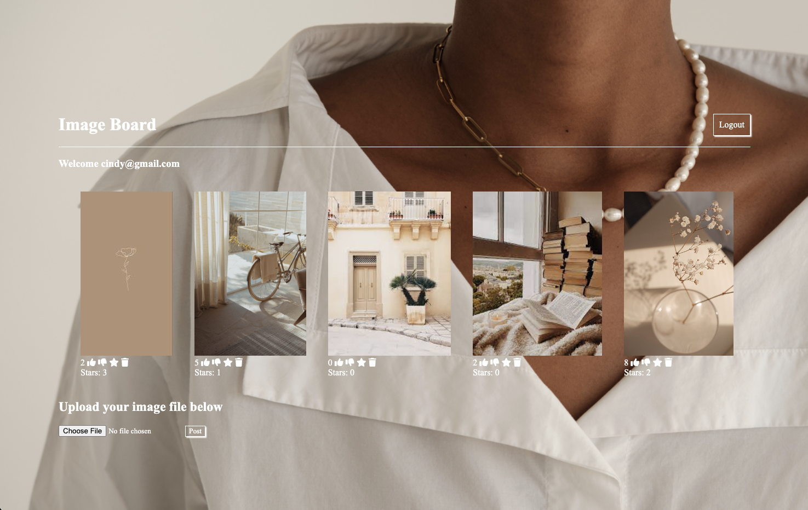

# Image Board App

Unleash your creativity with Image Board! 🎨 A full-stack app that lets you dive into a world of endless inspiration where every image tells a story. Upload, like, and explore curated boards to spark your imagination. Join the community today and be part of the visual revolution!

Check it out and let me know your thoughts! - https://myimageboard.onrender.com/ To demo a fully populated site, feel free to use these login credentials:

- Email: cindy@gmail.com
- Password: testing

## Tech Used:
- Javascript, Node.js, Express, MongoDB, Passport, HTML, CSS

### Things I'm proud of:
- I have always been a Pinterest / Tumblr girl at heart. So to build something that paid homage to these things was a huge milestone! I am a huge believer in community. And my hope with Image Board is that it fosters community centered around images and interactions. A place we can all go to inspire and be inspired.
- This was one of the first full-stack applications I ever built! It gave me a lot of foundational experience with MongoDB, and strengthened my understanding of CRUD functionality 

### 💡 Next steps:
- Currently the app has a centralized image board for all users to populate. The next thing I would do is create individual feeds for a more curated user experience
- The app currently allows for users to interact with the posted images by liking, disliking, starring and deleting. I would add more customization by allowing for the images starred to be populated on a users personal feed. While the most liked are repopulated to the top of the board. 
- The background image is my favorite image and is the current default. I would incorporate a new functionality where users are able to cuztomize to their preferred background.

## On your own machine: 

### Installation

1. Clone repo
2. run `npm install`

---

### Usage

1. run `node server.js`
2. Open [http://localhost:2000](http://localhost:2000) to view it in your browser
